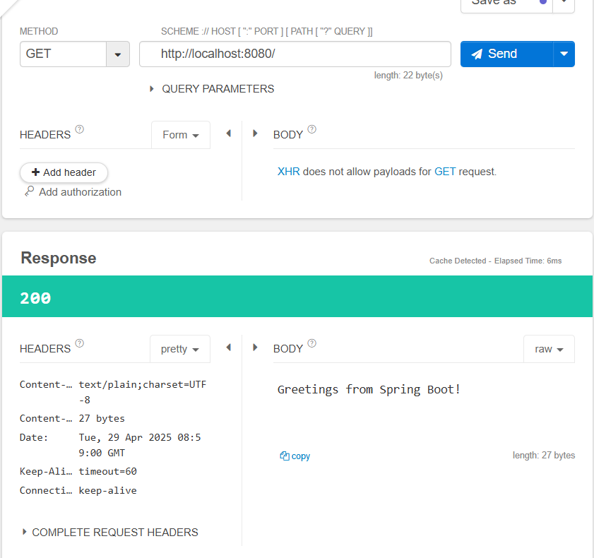
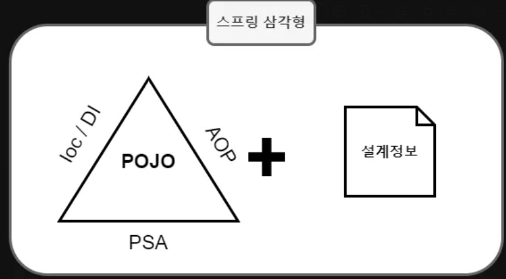
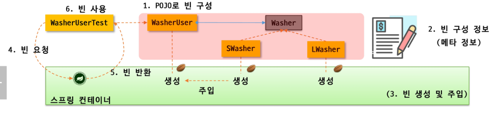

# Spring boot 스터디 1주차
## spring-tutorial

### 1️⃣ spring-tutorial를 완료하자!


### 2️⃣ spring이 지원하는 기술들(IoC/DI, AOP, PSA 등)을 자유롭게 조사해요

# 스프링 삼각형

### 스프링 삼각형은 Spring Framework의 핵심 철학!

# 1. POJO (Plain Old Java Object)
- 특정 프레임워크나 라이브러리에 종속되지 않은 자바 클래스
- 상속받거나 어노테이션을 붙이지 않아도 되는 순수 자바 클래스

### Honey : 그냥 평범한 자바 객체

# 2. IoC (Inversion of Control, 제어의 역전)
- 객체 생성과 제어 권한을 개발자가 아닌 스프링 컨테이너가 담당
- 코드에서 빈 어노테이션으로 나타냄
- 이 구조 덕분에 느슨한 결합 (Loosely Coupled) 가능
- 
### Honey : 나는 어떻게 되는건지 몰라 ~~

# 3. DI (Dependency Injection, 의존성 주입)
- 객체간 의존 관계를 스프링이 알아서 주입
- @Autowired, @Inject, 생성자 주입 등 사용
- IoC 원칙의 구현 방식 중 하나

### Honey : 스프링이 알아서 다해주네~~??

# 4. AOP (Aspect Oriented Programming, 관점 지향 프로그래밍)
- 핵심 로직과는 별개로 **공통된 기능(로그, 트랜잭션, 보안)**을 분리해서 관리
- 코드 중복 제거, 모듈화 향상
- @Aspect, @Before, @AfterReturning, @AfterThrowing, @Around

### Honey : 공통 기능은 따로 빼서 관리!

# 5. PSA (Portable Servivce Abstraction, 일관성 있는 서비스 추상화)
- 다양한 기술을 통일된 방식으로
- JDBC, 트랜잭션, 메시징, 캐싱등 다양한 영역에서 스프링이 제공하는 Template이나 Manager 클래스를 통해 PSA 구현


### 3️⃣ Spring Bean 이 무엇이고, Bean 의 라이프사이클은 어떻게 되는지 조사해요

# Spring Bean
- Spring IoC 컨테이너에 의해 관리되는 자바 객체
- 의존 관계 관리를 위해 DI 개념 사용

## Spring Bean의 생명 주기 (Lifecycle)
1. 객체 생성 -> 스프링 컨테이너가 Bean을 new 키워드로 생성
2. 의존성 주입 (DI) -> @Autowired 등으로 필요한 의존 객체를 주입
3. 초기화 콜백 (InitalizingBean, @PostConstruct) 
4. 사용 (비지니스 로직 수행) -> 실제 어플리케이션 로직 수행
5. 소멸 콜백 (DisposableBean, @ PreDestroy)



### 4️⃣ 스프링 어노테이션을 심층 분석해요

# 1. 어노테이션
- 어노테이션(Annotation)은 메타데이터(데이터에 대한 데이터)를 제공하는 문법적 요소
- 클래스, 메서드, 필드 등에 부가 정보를 붙이기 위해 사용
- 스프링은 어노테이션들을 보고 자동으로 객체 생성, DI, 요청 처리, 트랜잭션 처리 등을 수행

# 2. Java 어노테이션 구현 방식
- @Target : 어노테이션 적용 위치(클래스, 메서드, 필드 등)
- @Retention : 언제까지 유지할 것인가? (Source, Class, Runtime)
- @interface : 어노테이션 정의 키워드
```java
@Target(ElementType.TYPE) // 클래스에만 사용 가능
@Retention(RetentionPolicy.RUNTIME) // 런타임까지 유지됨
public @interface MyAnnotation {
    String value();
}
```

# 3. 스프링에서 어노테이션을 통해 Bean을 등록하는 과정
1. @SpringBootApplication 내부에 @ComponentScan 이 있음
2. @ComponentScan은 지정된 패키지 굥로에서 @Component가 붙은 클래스를 탐색
3. 스프링이 해당 클래스를 빈으로 등록 (ApplicationContext 내부에 저장)
4. 필요한 위치에 @Autowired 등으로 주입됨
## 대표 어노테이션 설명
- @Component : 일반 컴포넌트 등록
- @Service : 서비스 계층(기능은 @Component와 동일, 의미적 구분)
- @Repository : DAO 계층, 예외 변환 기능 부여
- @Controller : Web계층, MVC 컨트롤러로 인식됨
- @Configuration : 자바 기반 설정 클래스 표시
- @Bean : 개발자가 직접 Bean 객체를 등록할 떄 사용 (JavaConfig)
### 서비스, 레포지토리, 컨트롤러는 @Component의 확장이다.

## 의존성 주입(DI) 관련 어노테이션
- @Autowired : **타입 기반** 의존성 자동주입 (필드, 생성자, 메서드)
- @Qualifier : 같은 타입의 Bean이 여러개 일 떄 이름으로 지정
- @Inject : 자바 표준 어노테이션, @Autowired와 유사
- @Value : 외부 설정 값을 주입할 때 사용 (application.yml 등)
- @RequiredArgsConstructor : Lombok이 생성자 기반 주입 자동 생성

## 컴포넌트 스캔 관련 어노테이션
- @ComponentScan : 특정 패키지 내의 @Component 계열 클래스 자동 등록
- @SpringBootApplication : 여러 설정을 합쳐 놓은 어노테이션 (@ComponentScan 포함)
### @SpringBootApplication
- 내부적으로 3개의 어노테이션이 결합된 복합 어노테이션
- @Configuration : 설정파일(Bean 정의 클래스)
- @EnableAutoConfiguration : 클래스 패스의 라이브러리 정보를 보고 자동 설정
- @ComponentScan : 현재 패키지 기준으로 하위 패키지를 스캔해서 Bean 등록

## 웹 계층 어노테이션 (Spring MVC)
- @RequestMapping : URL 매핑, 메서드와 클래스에 매핑 가능
- @GetMapping, @PostMapping : 간편한 HTTP 메서드 매핑
- @PathVariable : URL 경로 변수 매핑
- @RequestParam : 쿼리 파라미터 매핑
- @RequestBody : JSON -> 객체 바인딩
- @ResponseBody : 객체 -> JSON 응답으로 리턴값 반환
- @ModelAttribute : 폼 데이터 바인딩, 뷰에 모델 객체 전달

## AOP 및 트랜잭션 관련 어노테이션
- @Aspect : AOP 클래스 정의
- @Before, @After, @Around : 메서드 실행전/후/전체 
- @Transactional : 트랜잭션 시작/커밋/롤백 관리
### AOP 용어 정리
- Aspect : 공통 기능을 모아놓은 클래스
- JoinPoint : AOP가 끼어들 수 있는 지점
- Pointcut : 어떤 JoinPoint에 적용할지 정의
- Advice : 실제로 실행되는 부가기능 코드
- Weaving : Advice를 JoinPoint에 연결하는 행위
```java
@Aspect
@Component
public class LoggingAspect {

    @Before("execution(* com.ssafy.service.*.*(..))") // pointcut
    public void logBefore(JoinPoint joinPoint) {
        System.out.println("메서드 실행 전: " + joinPoint.getSignature());
    }

    @AfterReturning(pointcut = "execution(* com.ssafy.service.*.*(..))", returning = "result")
    public void logAfter(JoinPoint joinPoint, Object result) {
        System.out.println("메서드 실행 후 결과: " + result);
    }
}
```
- JoinPoint 예시
```java
public void logBefore(JoinPoint joinPoint) {
    joinPoint.getSignature().getName(); // 메서드 이름
    joinPoint.getArgs();                // 파라미터 목록
}

```
## Bean 생명주기 관련 어노테이션
- @PostConstruct : 의존성 주입 이후 초기화 작업 수행
- @PreDestroy : 컨테이너 종료 전 정리 작업 수행

# 4. @ComponentScan의 탐색 원리

- @ComponentScan은 스프링이 클래스패스를 스캔하면서 @Component... 대표 어노테이션이 붙은 클래스를 찾아서 Bean으로 등록
### 내부 동작
- classPathScanningCandidateComponentProvider 컴포넌트가 .class 파일 탐색
- AnnotationMetadata로 어노테이션 정보를 파싱
- BeanDefinition으로 만들어 ApplicationContext에 등록
- basePackages 지정하지 않으면, @ComponentScan은 자기 클래스가 위치한 패키지 기준으로 하위 전부 스캔

# 5. 어노테이션 커스텀
```java
@Target(ElementType.TYPE)
@Retention(RetentionPolicy.RUNTIME)
@Component // 스프링이 인식할 수 있도록 반드시 붙여야 함
public @interface MyCustomService {
    String value() default "";
}
```
```java
@MyCustomService
public class CustomLogic {
    // Bean으로 등록됨!
}
```
- @Component를 포함한 메타 어노테이션 구조로 만들어야 스프링이 인식

### 5️⃣ **단위 테스트와 통합 테스트 탐구**

# 1. 단위 테스트 (Unit Test)
- 애플리케이션의 가장 작은 당위를 테스트
- 의존성 없이, 하나의 컴포넌트만 독립적으로 검증
```java
class Calculator {
    public int add(int a, int b) {
        return a + b;
    }
}

public class CalculatorTest {

    @Test
    void testAdd() {
        Calculator calc = new Calculator();
        assertEquals(5, calc.add(2, 3));
    }
}

```

# 2. 통합 테스트 (Integration Test)
- 여러 컴포넌트(ex : DB, Controller, Service)들이 함께 동작하는지 테스트
- 보통 Spring Context를 실제로 띄움 (@SpringBootTest)
- 실제 DB나 MockMvc와 통합하여 전체 흐름 테스트
```java
@SpringBootTest
@AutoConfigureMockMvc
public class UserControllerTest {

    @Autowired
    private MockMvc mockMvc;

    @Test
    void testGetUser() throws Exception {
        mockMvc.perform(get("/users/1"))
               .andExpect(status().isOk())
               .andExpect(content().string(containsString("user")));
    }
}
```

## 테스트 어노테이션
- @SpringBootTest : 전체 애플리케이션 컨텍스트 로드
- WebMvcTest : Controller 계층만 테스트 (Service/Db는 Mock)
- @DataJpaTest : Repository만 테스트
- @MockBean : 실제 Bean 대신 Mock 객체 주입

### 예제 프로젝트 구조
```css
src
├── main
│   └── java
│       └── com.example.demo
│           ├── DemoApplication.java
│           ├── controller
│           │   └── UserController.java
│           ├── service
│           │   └── UserService.java
│           └── repository
│               └── UserRepository.java
│
└── test
    └── java
        └── com.example.demo
            ├── unit
            │   └── UserServiceTest.java          ← 단위 테스트
            └── integration
                └── UserControllerIntegrationTest.java  ← 통합 테스트

```

## 에제 코드 구성
### UserService.java
```java
@Service
public class UserService {
    public String getUserName(Long id) {
        return "User" + id;
    }
}

```

### UserController.java
```java
@RestController
@RequestMapping("/users")
public class UserController {

    @Autowired
    private UserService userService;

    @GetMapping("/{id}")
    public String getUser(@PathVariable Long id) {
        return userService.getUserName(id);
    }
}

```

### UserServiceTest.java
```java
package com.example.demo.unit;

import com.example.demo.service.UserService;
import org.junit.jupiter.api.Test;
import static org.junit.jupiter.api.Assertions.*;

public class UserServiceTest {

    @Test
    void getUserName_shouldReturnCorrectName() {
        UserService userService = new UserService();
        String result = userService.getUserName(1L);
        assertEquals("User1", result);
    }
}

```

### UserControllerIntegrationTest.java
```java
package com.example.demo.integration;

import org.junit.jupiter.api.Test;
import org.springframework.beans.factory.annotation.Autowired;
import org.springframework.boot.test.context.SpringBootTest;
import org.springframework.boot.test.autoconfigure.web.servlet.AutoConfigureMockMvc;
import org.springframework.test.web.servlet.MockMvc;

import static org.springframework.test.web.servlet.request.MockMvcRequestBuilders.get;
import static org.springframework.test.web.servlet.result.MockMvcResultMatchers.*;

@SpringBootTest
@AutoConfigureMockMvc
public class UserControllerIntegrationTest {

    @Autowired
    private MockMvc mockMvc;

    @Test
    void getUser_shouldReturnUserName() throws Exception {
        mockMvc.perform(get("/users/1"))
               .andExpect(status().isOk())
               .andExpect(content().string("User1"));
    }
}

```